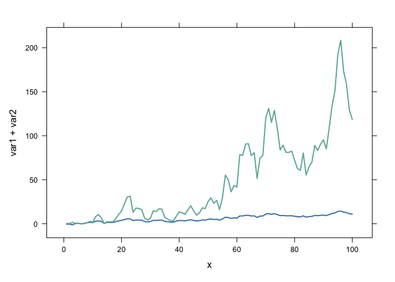
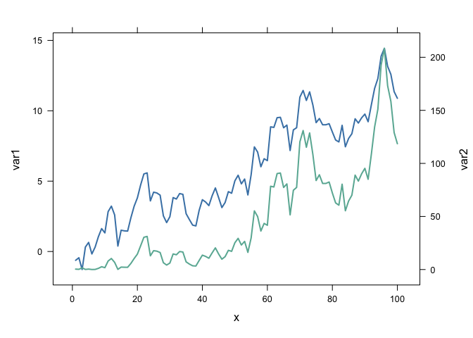
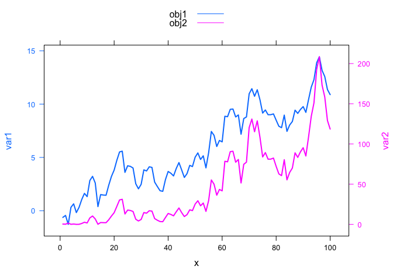

NTRES6100
================

# italic

<hr>

*lufthansa*

<br>

# bold

<hr>

**lufthansa**

<br>

# italic and bold

<hr>

***lufthansa***

<br>

# without blank, without change (1)

<hr>

-lufthansa <br> \*lufthansa

<br>

# without blank, without change (2)

<hr>

–lufthansa <br> \*\*lufthansa

<br>

# without blank, without change (3)

<hr>

—lufthansa <br> \*\*\*lufthansa

<br>

# with blank, with change (1)

<hr>

-   lufthansa <br>
-   lufthansa

<br>

# with blank, with change (2)

<hr>

– lufthansa <br> \*\* lufthansa

<br>

# with blank, with change (3)

<hr>

— lufthansa <br> \*\*\* lufthansa

<br>

# lufthansa

<br>

## lufthansa

<br>

### lufthansa

``` r
# range in R
x=c(5,2,7,9,4)
range(x)
```

    ## [1] 2 9

``` r
#[1] 2 9

# range in R - the NA issue
x=c(5,2,NA,9,4)
range(x,na.rm=FALSE)
```

    ## [1] NA NA

``` r
#[1] NA NA

# range in r - using na.rm to clean up results 
range(x,na.rm=TRUE)
```

    ## [1] 2 9

``` r
#[1] 2 9

# range in R - vectors with alphabetical data
x=c("c","r","e","a","g","e","r")
range(x)
```

    ## [1] "a" "r"

``` r
#[1] "a" "r"
```

``` r
x <- 1:10
y <- 11:20
z <- NULL
system.time(for (i in 1:length(x)){
  z <- c(z, x[i] + y[i])
})
```

    ##    user  system elapsed 
    ##   0.036   0.002   0.039

``` r
z 
```

    ##  [1] 12 14 16 18 20 22 24 26 28 30

``` r
x <- 1:10
y <- 11:20
z <- NULL
system.time(for (i in seq_along(x)) {
  z <- c(z, x[i] + y[i])
})
```

    ##    user  system elapsed 
    ##   0.005   0.000   0.005

``` r
z 
```

    ##  [1] 12 14 16 18 20 22 24 26 28 30

``` r
x <- 1:10
y <- 11:20
z <- NULL
system.time(for (i in range(x)) {
  z <- c(z, x[i] + y[i])
})
```

    ##    user  system elapsed 
    ##   0.009   0.000   0.010

``` r
z 
```

    ## [1] 12 30

``` r
x <- 1:10
y <- 11:20
z <- vector(length=10)
system.time(for (i in 1:length(x)){
  z[i] <- x[i] + y[i]
})
```

    ##    user  system elapsed 
    ##   0.006   0.000   0.006

``` r
z
```

    ##  [1] 12 14 16 18 20 22 24 26 28 30

``` r
x <- 1:10
y <- 11:20
z <- vector(mode = "double", length=10)
system.time(for (i in 1:length(x)){
  z[i] <- x[i] + y[i]
})
```

    ##    user  system elapsed 
    ##   0.005   0.000   0.005

``` r
z
```

    ##  [1] 12 14 16 18 20 22 24 26 28 30

``` r
#certain
for (i in 1:10) {
  print(i)
}
```

    ## [1] 1
    ## [1] 2
    ## [1] 3
    ## [1] 4
    ## [1] 5
    ## [1] 6
    ## [1] 7
    ## [1] 8
    ## [1] 9
    ## [1] 10

``` r
#uncertain
i <- 1
while(i<=10) {
  print(i)
  i <- i + 1
}
```

    ## [1] 1
    ## [1] 2
    ## [1] 3
    ## [1] 4
    ## [1] 5
    ## [1] 6
    ## [1] 7
    ## [1] 8
    ## [1] 9
    ## [1] 10

``` r
x <- 0
i <- 0
while (x < 2) {
  x <- rnorm(1,0,1)
  i <- i + 1
}
print(x)
```

    ## [1] 2.30168

``` r
print(i)
```

    ## [1] 144

``` r
sort(c (3, 1, 2, 5, 4, 2), decreasing = FALSE)
```

    ## [1] 1 2 2 3 4 5

``` r
sort(c (3, 1, 2, 5, 4, 2), decreasing = TRUE)
```

    ## [1] 5 4 3 2 2 1

``` r
rank(c (3, 1, 2, 5, 4, 2))
```

    ## [1] 4.0 1.0 2.5 6.0 5.0 2.5

``` r
c(3, 1, 2, 5, 4, 2)[order(c (3, 1, 2, 5, 4, 2))]
```

    ## [1] 1 2 2 3 4 5

``` r
order(c (3, 1, 2, 5, 4, 2))
```

    ## [1] 2 3 6 1 5 4

``` r
x <- 0
if (x < 0) {
print("Negative number")
} else if (x > 0) {
print("Positive number")
} else
print("Zero")
```

    ## [1] "Zero"

``` r
library(latticeExtra)
```

    ## Loading required package: lattice

``` r
# create data
set.seed(1)
x <- 1:100
var1 <- cumsum(rnorm(100))
var2 <- var1^2
data <- data.frame(x,var1,var2)
 
 
# usual line chart
xyplot(var1 + var2 ~ x, data, type = "l", col=c("steelblue", "#69b3a2") , lwd=2)
```

<!-- -->

``` r
#library
library(latticeExtra)
 
# create data
set.seed(1)
x <- 1:100
var1 <- cumsum(rnorm(100))
var2 <- var1^2
data <- data.frame(x,var1,var2)
 
 
# --> construct separate plots for each series
obj1 <- xyplot(var1 ~ x, data, type = "l" , lwd=2, col="steelblue")
obj2 <- xyplot(var2 ~ x, data, type = "l", lwd=2, col="#69b3a2")
 
# --> Make the plot with second y axis:
doubleYScale(obj1, obj2, add.ylab2 = TRUE, use.style=FALSE )
```

<!-- -->

``` r
#library
library(latticeExtra)
 
# create data
set.seed(1)
x <- 1:100
var1 <- cumsum(rnorm(100))
var2 <- var1^2
data <- data.frame(x,var1,var2)
 
 
# --> construct separate plots for each series
obj1 <- xyplot(var1 ~ x, data, type = "l" , lwd=2)
obj2 <- xyplot(var2 ~ x, data, type = "l", lwd=2)
 
# --> Make the plot with second y axis AND legend:
doubleYScale(obj1, obj2, text = c("obj1", "obj2") , add.ylab2 = TRUE)
```

<!-- -->
